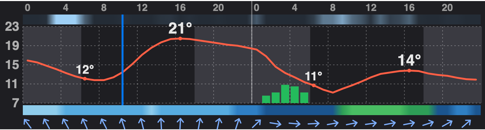

# Weather widget — 48 hours in one tiny chart

> **Fully coded by Claude AI** — not a single line of code was written manually by a human.

A small, dark **weather widget for today and tomorrow**, made to be read **from a distance** — e.g. on a tablet on the wall. **One PHP file**, no database, no JavaScript, no API key. Data from [Open-Meteo](https://open-meteo.com).



## What you see

| Element | Meaning |
|---|---|
| **Top bar** | Cloud cover — light blue = sun, dark grey = clouds |
| **Red line** | Temperature. Numbers on the curve: at sunrise, the daytime maximum (bigger) and at sunset |
| **Green bars** | Precipitation in mm/h. The snow part of a bar is blue, ❄ marks the biggest snowfall of the day |
| **Bottom bar** | Wind speed, coloured like a classic meteogram: light blue = calm, dark blue, green, yellow, red = storm |
| **Arrows** | Where the wind blows to, every 2 hours |
| **Blue vertical line** | Now |
| **Darker background** | Night — from the real sunset to the real sunrise |

The chart always starts at **today's midnight** — it does not move with the hour, so you always see the whole day.

## Why it looks like this

- **Every piece of information has its own channel** (line, bars, colour bars, arrows), so nothing drowns anything else out. You can tell "warm or cold, rain or not, windy or not" in one glance.
- **Rain = median of 5 weather models.** Rain is very local and a single model often misses it or moves it by a few hours. The median is not fooled by one model and catches what most of them see.
- **Square-root scale for rain.** Drizzle (0.1–0.4 mm/h, the most common rain) is invisible on a linear scale. Here it shows as a clear bar, while heavy rain still fits the chart.
- **Works offline.** The forecast is cached in a file for 30 minutes. Without internet the widget shows the last forecast, and after 3 hours it says how old it is.

## Install

You need PHP 7.4+ with the `curl` extension (any web server or shared hosting).

1. Copy `weather.php` to your web server.
2. Open it and set your location at the top:

```php
$LAT = 52.23;
$LON = 21.01;
```

3. Open `https://your-server/weather.php`.

## Use it

As a full page (refreshes itself every 15 minutes):

```
https://your-server/weather.php
```

Inside your own page, as an image:

```html

```

Or in an iframe:

```html
<iframe src="weather.php" style="width:100%;height:220px;border:0"></iframe>
```

## Weather models

Temperature, clouds and wind come from one model (`$BASE_MODEL`). The default is **UKMO** (UK Met Office), which is close to the best local high-resolution forecasts in Central Europe. Outside Europe set it to `best_match` — Open-Meteo then picks the best model for your location.

Precipitation is the median of `$RAIN_MODELS`. Two of them (ICON-D2, DMI HARMONIE) cover only Europe; elsewhere they return nothing and are skipped automatically.

## Where it comes from

This is the weather card of [TymOS](https://github.com/tymoteuszrogalewski/tymos), my smart home system, where it runs on a wall-mounted iPad kiosk. In TymOS the forecast is stored in a database; this standalone version needs only one file.

## License

MIT — see [LICENSE](LICENSE). Weather data: [Open-Meteo](https://open-meteo.com) (CC BY 4.0).
